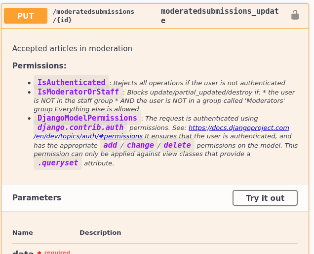

# Developer mini-blog

> Some notes I take while creating this project - nothing fancy but may help troubleshooting
> Most of this comes from following the [official tutorial](https://docs.djangoproject.com/en/2.2/intro/tutorial01/) and documentation of the libraries in use

---

## 2021-08-08 Restrict what users can see at view level

Using filtering we can make sure a user can't see objects they shouldn't:

```python
    def get_queryset(self):
        user = self.request.user
        if user.is_staff or user.is_superuser:
            return Submission.objects.all()
        return Submission.objects.filter(owner=user)
```

---

## 2021-08-08 Allow filtering on the REST interfaces

See the [reference](https://www.django-rest-framework.org/api-guide/filtering/).

* Add `django-filter` to requirements
* Add `filter_backends = [django_filters.rest_framework.DjangoFilterBackend]` to the Views we want to enable it for
* add `'django_filters',` to INSTALLED_APPS

We can now add to a rest framework view:

```python
class UserListView(generics.ListAPIView):
    ...
    filter_backends = [django_filters.rest_framework.DjangoFilterBackend]
    filterset_fields = ['status']
```

> Note this can be done for all of them by adding `"DEFAULT_FILTER_BACKENDS": ["django_filters.rest_framework.DjangoFilterBackend"],` to `REST_FRAMEWORK` in settings


We will also use another filter backend, included with rest-framework to allow a parameter like `?ordering=date_created`

```python
class UserListView(generics.ListAPIView):
    ...
    filter_backends = [filters.OrderingFilter]
    ordering_fields = ['date_created']
```

---

## 2021-08-01 Migrating to drf-spectacular

Up until now we have been using [drf-yasg](https://github.com/axnsan12/drf-yasg) and now we will be migrating to [drf-spectacular](https://github.com/tfranzel/drf-spectacular) as it's a more up to date project with similar targets.

* drf-yasg can produce documentation and OpenAPI schemas but it only supports version 2.0.
* drf-spectacular can do the same for OpenAPI 3.0

Migration involved:

* Remove yasg from requirements-common, pip uninstall it, add drf-spectacular
* Remove drf-yasg-stubs from requirements-local, pip uninstall it
* Replace drf_yasg with drf_spectacular in settings/APPLICATIONS.
* In settings/REST_FRAMEWORK add     "DEFAULT_SCHEMA_CLASS": "dogauth.views.SwaggerAutoSchema"
* In settings, remove SWAGGER_SETTINGS
* In dogauth/views our SwaggerAutoSchema class extends now 'drf_spectacular.openapi.AutoSchema' and now we override `get_description` to add a list of the permission restrictions we have defined via [permission classes](./dogauth/permissions.py)
* In dognews/urls.py we will now be following the drf-spectacular guide:

```python
from drf_spectacular.views import SpectacularAPIView, SpectacularRedocView, SpectacularSwaggerView
urlpatterns = [
    # YOUR PATTERNS
    path('api/schema/', SpectacularAPIView.as_view(), name='schema'),
    # Optional UI:
    path('api/schema/swagger-ui/', SpectacularSwaggerView.as_view(url_name='schema'), name='swagger-ui'),
    # path('api/schema/redoc/', SpectacularRedocView.as_view(url_name='schema'), name='redoc'),
]
```

Now we have:
* http://localhost:8000/schema to retrieve the openapi.yml schema
* http://localhost:8000/api/schema/swagger-ui/ to browse using the Swagger UI
* We could have also redoc but I've disabled it since Swagger seems nicer and allows requests froms the UI in a very intuitive way.

---

## 2020-10-7 Adding a manage.py custom command

I've got a lot of articles in Jekyll that I would like to import here. The original articles are
written in markdown with a yaml front matter. Since this is a one-off tasks but I may need to re-run
it I decided to try a custom management command. I will add later some other commands to publish
that initially will do the reverse process.

Simply created the following structure:

```python
news/
  management/
    commands/
      __init__.py
      import_from_jekyll.py
    __init__.py
  __init__.py
  ...
```

Note the `__init__.py` files are necessary for the module imports to resolve as expected.

The command itself is very simple, [just take a look](./news/management/commands/import_from_jekyll.py).

---

## 2020-10-03 Adding permissions information on the swagger documentation

By default "permissions" don't really exist as a concept in Swagger so everyone documents them their own way.

There is neat solution that uses dsr-yasg's ability to customize the output (yasg is our chosen swagger generator), following the solution [outlined in the answer to this question](https://github.com/axnsan12/drf-yasg/issues/358#issuecomment-545827035) that adds section with "Permissions" that simply lists all the permission names we have defined.

We simply create a class similar to that one (ours is in [./dogauth/views](./dogauth/views), and then register in settings.py:

```python
SWAGGER_SETTINGS = {
    "DEFAULT_AUTO_SCHEMA_CLASS": "dogauth.views.SwaggerAutoSchema",
}
```

It then will add:

* The permission name
* Whatever comment we have added to the permission class

as in:



With this in mind my "to do" now includes tidying up the comments in the Permission classes, and maybe naming too.

---

## 2020-09-19 Django extensions package (django-extensions)

This project includes a set of helper tools that are not needed for actually running the project but can save some time, I'll list here what I find useful.

These extensions all create new commands for `manage.py`.

Add to requirements.txt

```text
django-extensions
```

Add it to installed_apps:

```python
INSTALLED_APPS = (
    ...
    'django_extensions',
    ...
)
```

### List all possible endpoints

As a project grows big it can get messy to identify all the URLs. One option is to check the autogenerated documentation (see below), but for debugging, diagnosis it may be convenient to print all the possible urls. There's a nice discussion and code that [adds a new command to manage.py](https://stackoverflow.com/a/39504813) but I'll use django-extensions instead.

```bash
./manage.py show_urls
```

> This is particularly helpful to discover endpoints that we should add tests for and for matching endpoints to classes

### Better python shell

See all [the details in the documentation](https://django-extensions.readthedocs.io/en/latest/shell_plus.html) but shell_plus is a python shell that has required already all the module objects, so you can directly start with `NewsItem.objects.all()` etc.

You can also have it launch [ipython](https://ipython.org/) which is a nicer experience that the default shell. Check [ipython's usage here](https://ipython.readthedocs.io/en/stable/)

```bash
./manage.py shell_plus

# or

pip install ipython
./manage.py shell_plus --ipython
```

Some notes on ipython:

* `?` for help
* `!ls -al` to run shell commands
* `_` previous output
* `__` previous previous, `___` previous previous previous
* `help(object.method)` shows help string, as normal python
* `NewsItem?`shows docstring, file name, type
* `NewsItem??` shows the code
* `*News*?` wildcards can be used for searching objects
* `%load` load code
* `%page x` pretty print x, paged
* `%quickref` list more commands in a summary

### Create a graph of the models

```bash
sudo apt install -y graphviz
pip install pydotplus
./manage.py graph_models -a -g -o models.png
```

You can see the result here:


You can exclude models and columns (see [the documentation](https://django-extensions.readthedocs.io/en/latest/graph_models.html))

## Auto Generating documentation

There are a few ways to go about this. One thing we can do is manually generate an OpenAPI Schema representation. This is a yaml document expressing all the exposed methods that we have

```sh
python manage.py generateschema > openapi-schema.yml
```

> A lot can be tweaked here, check [docs](https://www.django-rest-framework.org/api-guide/schemas/)

There's tools that can consume that file and output various types of documentation pages.

Since I'm using django rest framework I'll be using [drf-yasg](https://github.com/axnsan12/drf-yasg) that integrates nicely with it. With a couple of changes the documentation will appear 'magically':

* Load drf_yasg as an application in settings.py
* Create a schema_view in urls.py using its get_schema_view function
* Expose the patterns we want for swagger json/yaml, swagger UI and/or redoc (alternative view)

Exposed URLs are:

* /swagger.json
* /swagger.yaml
* /swagger/
* /redoc/

## Creating per-environment configuration

I have currently three needs: local, dreamhost and test

Created:

* requirements-common.txt (common)
* requirements-dreamhost.txt
* requirements-local.txt
* module dognews.settings
  * base.py (common)
  * dreamhost.py (imports base, extends)
  * local.py
  * test.py

Launch with settings:

```sh
export DJANGO_SETTINGS_MODULE=dognews.settings.local
python manage.py runserver
```

---

## 2020-06-21 Authentication and authorization using JWT (JSON web tokens)

Django does not support JWT directly but it does support token authentication. The principles are similar:

* A login endpoint that returns a pair of { access_token, refresh_token }
  * access_token: short-lived (5 minutes typically)
  * refresh_token: long-lived (for example 1 day)

For authorization, the tokens can include role information (see Authorization section below)

### Typical code for an client application that would use JWT

This is just an example, this could be any language:

```python
class MySimpleClient:
    credentials = { "access_token": None, "refresh_token": None }
    userpass = { "username": None, "password": None }

    def __init__(username, password):
        userpass = { "username": username, "password": "password" }

    def login():
        """ requests a new token using user/pass - implicitly called by the client methods """
        response = client.post("/token", userpass)
        if responses.status == 401:
            return Exception('403 Forbidden: invalid user or password')
        credentials = response.data

    def refresh():
        """ refreshes a token using refresh_token, relogins if that fails - implicitly called by client methods """
        if credentials["refresh_token"] is not None:
            response = client.post("/token/refresh", { "token": credentials["refresh_token"] })
            if response.status == 401:
                login()   # needs relogin, likely expired
        else:
            login()    # first time login

    def post(endpoint, data, headers):
        if credentials["access_token"] is None:
            login()
        response = client.post(endpoint, data, headers = {'authorization': f'Bearer {credentials["access_token"]}', **headers})
        if response.status == 401:
            login()
            response = client.post(endpoint, data, {'authorization': f'Bearer {credentials["access_token"]}', **headers})
        return response

    def get(endpoint, headers):
        if credentials["access_token"] is None:
            login()
        response = client.get(endpoint, headers = {'authorization': f'Bearer {credentials["access_token"]}', **headers})
        if response.status == 401:
            login()
            response = client.get(endpoint, {'authorization': f'Bearer {credentials["access_token"]}', **headers})
        return response

    def update(...):
    def patch(...):
    def delete(...):
        ...
```

### Adding JWT to django and django-rest-framework

Django doesn't support JWT directly, the recommended package is  djangorestframework-simplejwt.

> Note that the library was looking for maintainers but seems to be now maintained by a group of devs under SimpleJWT. It can always be forked and tweaked as it's MIT-licensed. Another library called djangorestframework-jwt is now deprecated.

Add to requirements.txt:

```text
djangorestframework-simplejwt
```

Define SIMPLE_JWT in settings.py, see the [detailed explanation of options](https://django-rest-framework-simplejwt.readthedocs.io/en/latest/) and the [github project page](https://github.com/SimpleJWT/django-rest-framework-simplejwt).

```python
SIMPLE_JWT = {
    'ACCESS_TOKEN_LIFETIME': timedelta(minutes=5),
    'REFRESH_TOKEN_LIFETIME': timedelta(days=1),
}
```

Enable this as a new 'authentication class':

```python
REST_FRAMEWORK = {
    ...
    'DEFAULT_AUTHENTICATION_CLASSES': (
        ...
        'rest_framework_simplejwt.authentication.JWTAuthentication',
    )
    ...
}
```

In the main `urls.py` file, we now need to define endpoints for creating a token, refreshing it and (optional) verifying it:

```python
from rest_framework_simplejwt.views import TokenObtainPairView, TokenRefreshView, TokenVerifyView

urlpatterns += [
    path('api/token/', TokenObtainPairView.as_view(), name='token_obtain_pair'),
    path('api/token/refresh/', TokenRefreshView.as_view(), name='token_refresh'),
    path('api/token/verify/', TokenVerifyView.as_view(), name='token_verify),
]
```

## Authorization with JWT

Make sure to have checked [Authentication with JWT tokens](#Authentication-with-JWT-tokens)

JWT adds some information to the token that can be retrieved in the backend without having to go to the database.
One use for this is to store in there the roles of a user and other useful information. This are called 'claims' in this context.

Generate a new view in views.py:

```python
from rest_framework_simplejwt.serializers import TokenObtainPairSerializer
from rest_framework_simplejwt.views import TokenObtainPairView

class CustomTokenObtainPairSerializer(TokenObtainPairSerializer):
    @classmethod
    def get_token(cls, user):
        token = super().get_token(user)
        token['name'] = user.name
        token['groups'] = [group.name for group in user.groups.all()]
        return token

class CustomTokenObtainPairView(TokenObtainPairView):
    serializer_class = MyTokenObtainPairSerializer
```

And then register that view in urls.py instead of the default one:

```python
urlpatterns += [
    path('api/token/', CustomTokenObtainPairView.as_view(), name='token_obtain_pair'),  # <=== CHANGED view
    path('api/token/refresh/', TokenRefreshView.as_view(), name='token_refresh'),
    path('api/token/verify/', TokenVerifyView.as_view(), name='token_verify),
]
```

---

2020.05.21 Object-level permissions: Going back to basics

Overall it all seems a bit too magic and not part of django or django-rest-framework so instead of that I'm going to basic and do it implementing the has_permission methods as in [the official django-rest-framework documentation](https://www.django-rest-framework.org/api-guide/permissions/)

For the example of newsItem:

```python

# an example of a non-per object permission
class IsAuthenticated(permissions.BasePermission):
    def has_permission(self, request, view):
        return request.user.is_authenticated

# an example of a per-object permission
class IsOwnerOrStaff(permissions.BasePermission):
    def has_object_permission(self, request, view, obj):
        if view.action == 'update' or view.action == 'partial_update' or view.action == 'destroy':
            return obj.user == request.user or request.user.is_staff
        return True

class RatingViewSet(viewsets.ModelViewSet):
    serializer_class = RatingSerializer
    queryset = Rating.objects.all()
    permission_classes = (IsOwnerOrStaff,)
```

Note that above, to not split the viewset into the individual views (because it's nicer to have less code), I've added a check in the permission itself, so it does one thing or another depending on the action.

For extended cases it's probably better to just not use ViewSets and instead use the generic views directly, like:

```python
class UserView(generics.ListCreateAPIView):
    permission_classes = (...,)
    ...

class UserView(generics.UpdateAPIView):
    permission_classes = (...,)
    ...
```

---

## 2020.05.17 Exploring object-level permission frameworks

The default model permissions are good for quick admin pages, as they determine which staff users have access to what in a broad sense.

* Example: users in the group 'admins' can see and edit all models
* Example: users in the group 'new_moderators' can see and edit all articles in the News model, but nothing else etc

For external or system users we may want some more specific permissions. We can do this by overriding the has_permission method but there are also frameworks that fulfill this.

* Example: a user can change their own rating, but not any other's

### Trying django-guardian

With django-guardian: add it to `requirements.txt` and add 'guardian' to `INSTALLED_APPS` `in settings.py`.

Add `'guardian.backends.ObjectPermissionBackend',` to the `AUTHENTICATION_BACKENDS` (at the end), or add the whole variable if missing:

```python
AUTHENTICATION_BACKENDS = (
    'django.contrib.auth.backends.ModelBackend', # default
    'guardian.backends.ObjectPermissionBackend',
)
```

This creates the tables 'guardian_groupobjectpermission' and 'guardian_userobjectpermission'.

Run `manage.py migrate`.

From then on you can add permissions to specific objects, for instance now we can make sure that existing users can
only modify their own ratings by allowing the 'change' permission only to the own user:

```python
from guardian.models import UserObjectPermission
for newsItem in NewsItem.objects.all():
    for rating in newsItem.ratings.all():
        UserObjectPermission.objects.assign_perm('change_rating', rating.user, obj=rating) # would not be allowed delete
```

We will need code to add this logic on creation. **For Admin pages** we can use the PermissionRequireMixin:

```python
class NewsItemView(PermissionRequiredMixin, ModelView)
    def form_valid(self, *args, **kwargs):
        resp = super().form_valid(*args, **kwargs)
        assign_perm('view_article', self.request.user, self.object)
        assign_perm('change_article', self.request.user, self.object)
        assign_perm('delete_article', self.request.user, self.object)
        return resp
```

This doesn't seem to be the best match for this particular app mostly because of the database approach, but it does allow a model I may like so I'll leave this as a reference here.

### Trying django-rules

This is [another per-model permission framework](https://github.com/dfunckt/django-rules) that offers integration with django-rest-framework.

Installation: add 'django-rules' to requirements.txt, 'rules' to INSTALLED_APPS, set the auth backends:

```python
AUTHENTICATION_BACKENDS = (
    'rules.permissions.ObjectPermissionBackend',
    'django.contrib.auth.backends.ModelBackend',
)
```

This framework is based on the concept of 'predicates', instead of database rules these are functions that determine if a permission is given or not.
Any function can be a predicate.

There's some useful predefined predicates:

* is_authenticated(user)
* is_superuser(user)
* is_staff(user), staff users
* is_active(user)
* is_group_member(*groups)  (must pertain to all of those groups)

```python
@rules.predicate
def belongs_to_user(user, rating):
    return rating.user == user

# option 1: there is a 'bag' of rules we can use if we add them in models or views:
rules.add_rule('belongs_to_user', belongs_to_user)

# option 2: we can instead define a 'permission' which is a rule associated to a model
rules.add_perm('rating.change_rating', belongs_to_user | is_staff)

# option 3: (needs !) we can also declare them as part of the models themselves
from django.db import models
from rules.contrib.models import RulesModelBase, RulesModelMixin
class NewsItem(RulesModelMixin, models.Model, metaclass=RulesModelBAse):
    class Meta:
        rules_permissions = {
            'add': rules.is_staff
            'change': belongs_to_user | rules.is_staff,
        }

# option 4: (needs 2) we can add them to views
from rules.contrib.views import PermissionRequiredMixin
class NewsItemUpdate(PermissionRequiredMixin, UpdateView):
    model = NewsItem
    permission_required = 'rating.change_rating'

```

> Predicates can be combined with &, |, ^ (P1 ^ P2 = true if only one of them is True), ~

---

## 2020.05.19 Populate initial permission data

Create an empty migration:

```python
DJANGO_SETTINGS_MODULE=xxxx python manage.py makemigrations restapi --empty
```

This will generate a file in `restapi/migrations/00XX_auto_YYYYDDMM_HHMM.py`.

It will contain a reference to the predecesor (last migration) automatically added.

Django contains some magic that allows you to use the models as they were in a point in time

```python
def create_admin_group(apps, schema_editor):
    # very important to not import directly the model
    Group = apps.get_model('auth', 'Group')
    Permission = apps.get_model('auth', 'Permission')
    admin_group, _ = Group.objects.get_or_create(name=f"admin")
    admin_group.permissions.add(
        *Permission.objects.filter(codename="view_newsitem"),
        *Permission.objects.filter(codename="add_newsitem"),
        *Permission.objects.filter(codename="change_newsitem"),
        *Permission.objects.filter(codename="delete_newsitem"),
        *Permission.objects.filter(codename="view_rating"),
        *Permission.objects.filter(codename="add_rating"),
        *Permission.objects.filter(codename="change_rating"),
        *Permission.objects.filter(codename="delete_rating"),
    )
    admin_group.save()
```

Then we just have to add the operation to the list of things to do on this migration:

```python
operations = [
        migrations.RunPython(create_admin_group),
    ]
```

You can execute them by running `./manage.py migrate`

---

## 2020.04.12 Creating admin pages for our models

Add to [./restapi/admin.py](./restapi/admin.py) what we want shown on the /admin pages:

```python
class NewsItemRatingInline(admin.StackedInline):
    model = NewsItemRating
    min_num = 0
    extra = 0  # determines number of empty elements for new objects

@admin.register(NewsItem)
class NewsItemAdmin(admin.ModelAdmin):
    inlines = [
        NewsItemRatingInline
    ]
```

> Note: without extra = 0 it creates 3 empty objects in the form (this is in InlineModelAdmin, where it declares extra = 3 god knows why)

---

## 2020.04.12 Creating some models

This project is going to be very simple so we will likely only have one 'app' (it's a modular unit for django, a subset of functionality).

```sh
django-admin startapp restapi
```

This is the structure now:

```text
├── db.sqlite3       <-- empty initial database
├── dognews
│   ├── __init__.py
│   ├── settings.py
│   ├── urls.py
│   └── wsgi.py
├── manage.py
├── requirements.txt
├── restapi
│   ├── admin.py
│   ├── apps.py
│   ├── __init__.py
│   ├── migrations
│   │   └── __init__.py
│   ├── models.py
│   ├── tests.py
│   └── views.py
└── .venv
```

Created some basic stubs of the models that you ca see here [./restapi/models.py](./restapi/models.py)

A model is just the definition of fields, relations and restrictions (validations) for an entity.

> Check [Django's guide on modules](https://docs.djangoproject.com/en/3.0/topics/db/models/)

Some notes:

* blank=True defines a field as not required
* for dates, we set default=django.admin.timezone.now - note that we pass the function, not a value - this sets the correct now() field on save, using datetime.now() would just store the one at launch time
* need to add to INSTALLED_APPS 'restapi' so it loads it
* the n to m relation between news item and its ratings is defined in ratings with a FK field: `newsItem = models.ForeignKey(NewsItem, on_delete=models.CASCADE)`
* for embedded serialization (ie newsitem object includes a list of rating objects), simply generate a serializer for ratings and add it to the newsitem serializer as `ratings = RatingSerializer(many=True, required=False)`
* to represent externally in a json API where you can update a rating directly with a patch, I'm using the python module `rest_framework_nested`, an extension to django rest framework: creating a new nested router inside urls.py for it and extending the serializer to work nicely with it

Every time we modify the models, a migration needs to be created. Django does this magically with:

```bash
> ./manage.py makemigrations restapi
Migrations for 'restapi':
  restapi/migrations/0001_initial.py
    - Create model NewsItem
    - Create model NewsItemRating
```

---

## 2020.04.12 Explore django rest framework's browseable API

Django Rest Framework exposes a UI that can be used to browse the API with a nice HTML page that lets you click around, POST, GET, PUT, DELETE.

Example: Going to [localhost:8181](http://localhost:8181) shows this _Browseable API_ list of available URLs:

```text
HTTP 200 OK
Allow: GET, HEAD, OPTIONS
Content-Type: application/json
Vary: Accept
{
    "users": "http://localhost:8181/users/",
    "groups": "http://localhost:8181/groups/"
}
```

Click on the users and groups links to go to their pages.

You can verify / use an alternative editor through the Django Admin console, which is unrelated to the django rest framework and  lives under `/admin` [localhost:8181/admin](http://localhost:8181/admin).

> NOTE: password is not in the forms displayed by REST for the users, nor is it in the Admin console UI directly. Password change is done through `http://localhost:8181/admin/password_change` in the admin console, that has the typical 'previous password' requirement.

---

## 2020.04.12 Enable pagination on responses

We can easily configure the rest framework to return paginated results, in settings.py:

```python
REST_FRAMEWORK = {
    'DEFAULT_PAGINATION_CLASS': 'rest_framework.pagination.PageNumberPagination',
    'PAGE_SIZE': 10
}
```

---

## 2020.04.12 Adding initial rest framework views

> Check [Django Rest Framework](https://www.django-rest-framework.org/)

DRF helps build production ready APIs with minimal code and it integrates with existing django models and project structure.

```sh
echo 'djangorestframework>=3' >>requirements.txt
pip install -r requirements
```

Enable the rest framework itself by adding the string `'rest_framework'` to the `INSTALLED_APPS` array in [./dognews/settings.py](./dognews/settings.py).

A few quick concepts in Django Rest Framework:

* Serializer: representation of the model, similar to a POJO in java, or a json object
* View: the exposed actions (determins what urls are available and what is shown on each, for instance 'a list of all user')

### Create serializers for the auth objects

The auth module (check [django.contrib.auth on Django](https://docs.djangoproject.com/en/3.0/ref/contrib/auth/)) is standard in django and provides simple user/group/permission authentication and authorization.

```python
from django.contrib.auth.models import User, Group
from rest_framework import serializers

class UserSerializer(serializers.HyperlinkedModelSerializer):
    class Meta:
        model = User
        fields = ['url', 'username', 'email', 'groups']

class GroupSerializer(serializers.HyperlinkedModelSerializer):
    class Meta:
        model = Group
        fields = ['url', 'name']
```

Add this to `restapi/serializers.py`

### Create some views for the auth objects

We will not be actually publishing user and group lists via REST these for this application, but they are an easy way to get to grips with the concepts:

```python
from django.contrib.auth.models import User, Group
from rest_framework import viewsets
from tutorial.quickstart.serializers import UserSerializer, GroupSerializer

class UserViewSet(viewsets.ModelViewSet):
    queryset = User.objects.all().order_by('-date_joined')
    serializer_class = UserSerializer

class GroupViewSet(viewsets.ModelViewSet):
    queryset = Group.objects.all()
    serializer_class = GroupSerializer
```

We add this to the existing `restapi/views.py`

> Note! There is a 'trick' here in that the 'ViewSet' is actually creating a lot of Views for the common behaviour associated to a model. In this case we give it the starting point, a query to the User model and that is enough for it to figure out views to list / add / delete and patch (update) entries. For some corner cases we may need to add individual views, or override those. It's exposing:
> OPTIONS: to get a list of available actions for a URL and content types allowed
> GET, PUT, DELETE: according to the model and relations

### Map views to urls

Finally we just need to publish the views we have created using the rest framework version of a 'router':

```python
from django.urls import include, path
from rest_framework import routers
from tutorial.quickstart import views

router = routers.DefaultRouter()
router.register(r'users', views.UserViewSet)
router.register(r'groups', views.GroupViewSet)

urlpatterns = [
    path('', include(router.urls)),
    path('api-auth/', include('rest_framework.urls', namespace='rest_framework'))
]
```

With this we are publishing under `/users`, `/groups` and ca do things like `GET /users/0/groups`.

About the `api-auth/` URLs there, they are suggested by the DRF tutorial:
> Finally, we're including default login and logout views for use with the browsable API. That's optional, but useful if your API requires authentication and you want to use the browsable API.

---

## 2019.11.04 Initial project creation

> Check [virtualenv](https://virtualenv.pypa.io/en/stable/) for more. Check [django](https://docs.djangoproject.com/en/3.0/) for more.

```sh
virtualenv -p python3.8 .venv
source .venv/bin/activate
echo 'Django>=3' >>requirements.txt
pip install -r requirements.txt
django-admin startproject dognews
```

Now we have the following structure:

```text
├── .venv
├── requirements.txt
└── dognews
    ├── dognews
    │   ├── __init__.py
    │   ├── settings.py  <--- DB configuration, auth, i18n, static
    │   ├── urls.py    <--- routes, 'admin/' pointing to default Admin UI
    │   └── wsgi.py   <-- for gunicorn et al
    └── manage.py   <-- tool we will use to further interact with django admin
```

> Note that the top level 'dognews' name isn't used, and it's all redundant so I moved dognews/dognews and manage.py one folder up

```text
├── dognews
│   ├── __init__.py
│   ├── settings.py
│   ├── urls.py
│   └── wsgi.py
├── manage.py
├── requirements.txt
└── .venv
```

Run it

```sh
source .venv/bin/activate
./manage.py --help
./manage.py migrate         # init database
./manage.py runserver 8181  # test it
```

Going to [localhost:8181/admin](http://localhost:8181/admin) you can check it's running.

After the `migrate` command above, the db has some tables now:

```bash
> ./manage.py dbshell
sqlite> .databases
main: /(...)/dognews-server/db.sqlite3
sqlite> .tables
auth_group                  auth_user_user_permissions
auth_group_permissions      django_admin_log
auth_permission             django_content_type
auth_user                   django_migrations
auth_user_groups            django_session
```

Finally we need to create an initial _superuser_

```bash
python manage.py createsuperuser --email xxxx@xxxxxxx.xxx --username XXXXX
```

## Helpful tools

```sh
./manage.py shell

./manage.py dbshell

./manage.py changepassword {username}
```

Then you can import models, list, create etc
