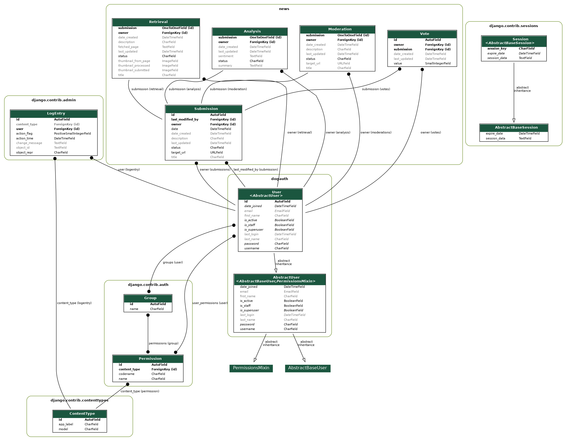

# Dog News - Server

This project is the backend server for the Only Dog News web site and application.

*This is a work in progress and a personal playground project*, currently
implemented using Django 3 and django-rest-framework.

> It's licensed under BSD, feel free to copy bits and parts and check the [Development notes](./DEV\ NOTES.md) for more details and a kind of technical blog. Although it's very specific, it may be tweaked to adjust your use case for a quick start.

NOTE: Incompatibility between drf-extensions and django 3.1

* Tracked in the [drf-extensions](https://github.com/chibisov/drf-extensions/issues/294)
* Workaround until release:
  * `pip3 install https://github.com/chibisov/drf-extensions/archive/master.zip`

## Requirements

This is a server to support 'Only dog news, a very simple news aggregator for me and my friends.

The site holds 'happy dog news' curated by humans, since automated solutions render too many false positives (in particular, many stories are horrible and many sources are very spammy).

We want to be able to:

* Post a news articled found in the web, with an optional description
* Summarise and preprocess posted articles (web scraping, summary, sentiment analysis to flag 'unhappy' news) to minimise the human work needed
* Offer a list of posted and processed items that can be voted up/down or flagged
* Allow a moderator to approve/tweak those articles for publication
* Display the approed articles, for reading

This should be available through a web site and from a mobile application that
makes it easier to check a news article in a private web view.

> Note: supporting a scenario like this is easy with Wordpress or other off the shelf products. This is just a pet project to test various technologies both on server and client.

## Concepts

### Users and Groups

The idea is to have a collaborative way of submitting and review dog news,
helped by bots that will do some initial analysis. The possible groups are:

* Admins
* Bots
* Moderators
* Collaborators
* Anonymous

See more details on [Permissions](#Permissions) below.

## Posted Items

Users find news articles on the net and want to suggest them: they can send a
link to a news article to be considered for publication. The submit form has
the URL and allows optional one line title and short description.

> Currently to suggest a URL you have to be a collaborator on the site

Posts will be rejected if the are from a blocked domain or if they have
already been submitted (exact url already exists).

Holds information on the url, title, description, who submitted it and a status.

## Moderation Queue

Posted items are processed by a bot that fetches the text from the web and
stores a copy of the source html. This will fail to scan text when it is
dynamically loaded via javascript. In those cases we will rely ono the
submitted header/description, or on a moderator adding it.

Other bots will parse the fetched text and extract automatic information like
summary, thumbnail etc and detect possible ugly news (sentiment analysis).
This information is all added to the record in the database, and the
article is not available for moderator review until all of them have run.

Once a moderation article is ready for revied, moderators can edit the title,
description and thumbnail if the want. If they are not provided, by default
it will be set to be either the ones submitted or the ones generated.

Items that are not in the 'Ready for review' status can't be modified.

To help with moderation, other users ('Collaborators') can view the list
and although they can't edit the fields they can add a [vote](#Votes) and
see other people's votes.

Contains submitter and approver/rejecter information.

## Votes

Articles in moderation queue can have vote of Up, Down, Flag given by
collaborators.

Each vote contains the value and the user giving it. Flag is for spam or
unhappy things like dead dogs etc

Votes belong to one article. A user that can add a vote can edit and delete
it, but votes can't be modified by users that did not create them.

## Article List

The approved entries from the moderation queue are transformed into
articles that will be published on the web site and application, and can
be retrieved publicly, ordered by date.

The have the original submitter, final title, description, url, thumbnail, and
a link to the original posted item.

## Permissions

### Anonymous users

* Can read the list of articles and find individual articles by id, date, etc

### Collaborators

* Can add new items to the posted items queue
* Can read the list of articles
* Can read the moderation queue items that are 'ready for review'
* Can add votes to moderation queue items

### Moderators

* Can add new items to the posted items queue
* Can read aarticles in the moderation queue
* Can modify a moderation items that are Ready for review and change:
  * status:
    * Rejected: with reason (Spam, Not happy, Dup, Bad source, None)
    * Published
  * Can edit title, text, image
  * Can read other fields
  * Items that are not ready for review can not be edited but can be read

### Functionality Bots

* Each bot has its own user
* Can read from the Posted items queue
* Can edit posted item to mark them as Processed, Rejected with reason (Malformed, Can't read, Dup, Spam, Sentiment)
* Can add items to the moderation queue

### Admins

* Can do all modifications and edition (but don't have as much power as the django superadmins)

## Translating the concepts into django Models

### User

Extends django.contrib.auth.User but doesn't add anything to it at this stage

### Group

We use django.contrib.auth.Group unmodified

### Submission

Filled on create:

* auto id
* target_url (unique)
* user
* title (optional)
* description (optional)
* status: (New, Accepted, Rejected: Could not fetch)
* date created
* last updated

Filled by bots:

* fetched_page: retrieved data
* fetched_date: when it was retrieved

### ModeratedSubmission

Filled on create:

* auto id
* submission: fk submission
* status: (Processing, Ready for review, Accepted, Rejected: Spam, Rejected: Duplicate, Rejected: Generic)
* date created
* last updated

Filled initially and editable by moderator:

* target_url: set to copy of target url
* title: set to copy of submitted text (if present)
* description: set to copy of submitted description (if present)
* thumbnail: set to emtpy initially, set to generated thumbnail afterwards

Filled by bots:

* bot_title: usually from opengraph, provided by the site itself
* bot_summary: usually from opengraph, provided by the site itself
* bot_image_url: usually from opengraph, provided by the site itself
* bot_summary: summarised from fetched_text
* bot_sentiment: automatically set based on sentiment analysis
* bot_thumbnail: image name

Filled by collaborators:

* votes: set of Votes given by users

### Vote

Filled on create:

* auto id
* user: fk user
* moderated_submission: fk ModeratedSubmissions
* value: up, down, flag
* unique together: (user, moderated_submission)

### Article

* auto id
* url (unique)
* submmiter: fk User
* title
* description
* moderated_submission: fk PostedItems (can be null, on_delete set_null)
* date created
* last updated

## Bots

A number of bots with specific tasks work on the items. Each bot is created
as a user in the database, belonging to the group 'Bots'

### Fetch bot

Input

* PostedItems with status = New

Action

* if domain(url) in blacklist mark PosedItem as rejected: Blacklist
* fetch url from the net
* if fetched: create new item in ModerationQueue, mark PostedItem as accepted
* if error: if error is temporary do nothing, else mark PostedItem as rejected: could not fetch

## Analysis bot

Input

* ModerationQueue entries with status = Processing and generated_sentiment null

Action

* parses fetched_text, saves generated_sentiment = '' | 'bad'

### Summary bot

Input

* ModerationQueue entries with status = Processing and generated_summary null

Action

* parses fetched_text and generates a human readable generated_summary

### Thumbnailer

Input

* ModerationQueue entries with status = Processing and generated_thumbnail null

Action

* if extracted_image_url is not null, it tries to fetch it and generate
  a square thumbnail, store it and save the name of the generated_thumbnail
* if the value is null or fails to fetch, sets generated_thumbnail to 'default-thumbnail.png'

### Accepter

Input

* ModerationQueue entries with status = Processing and generated_thumbnail,
  generated_sentiment, generated_summary not null

Action

* Marks item as status Ready for review
